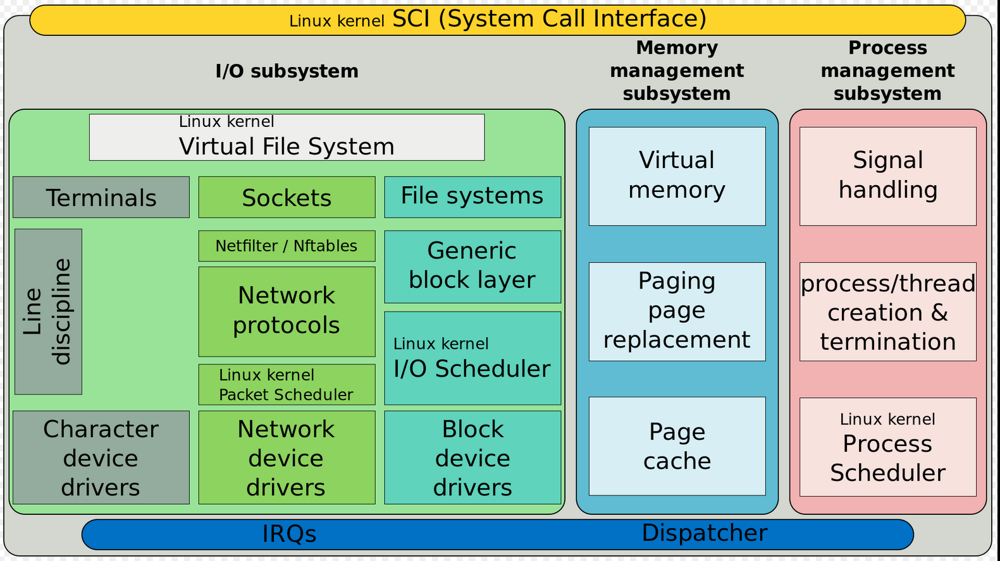
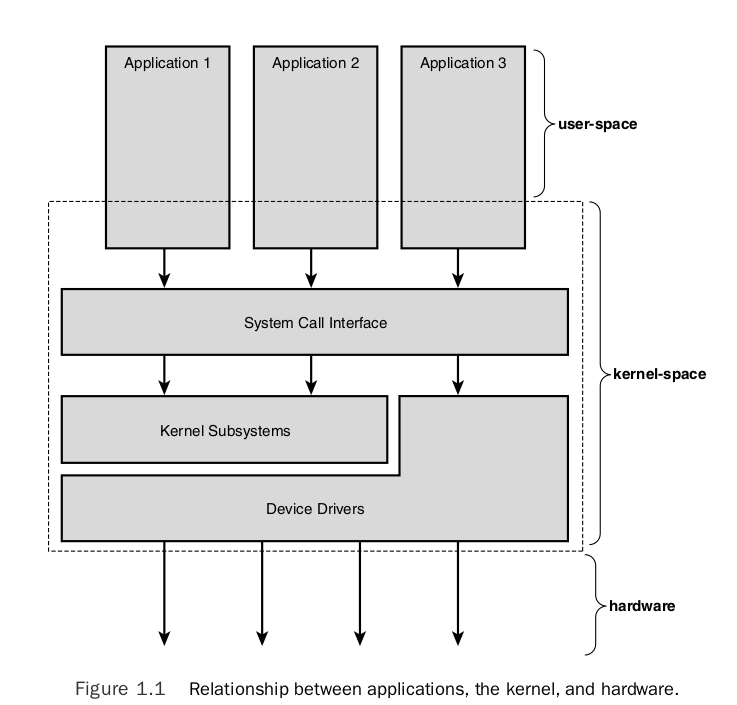

# Linux Kernel



## Linux Kernel Main Roles:

- **Manage all the hardware resources**: CPU, memory, I/O
- Provide a **set of portable, architecture and hardware independent APIs** to allow user
  space applications and libraries to use the hardware resources.
- **Handle concurrent accesses and usage** of hardware resources from different applications

## Kernel tasks:

- System initialization: detects hardware resources and play a a roll on booting the system
- Process scheduling: determines when processes should run and for how long
- Memory management: allocates memory on behalf of running processes
- Security: Constantly verifies filesystem permissions, firewall rules
- Provides buffers and caches to speed up hardware access
- Implements standard network protocols and filesystem formats

## Kernel Initialization

When the power is applied to an embedded Linux system, a complex
sequence of events is started. After a few tens of seconds, the
Linux kernel is operational and has spawned a series of application
Programs as specified by the system init scripts.

Upon power-on, the bootloader in an embedded system is the first
software to get processor control. After the bootloader has performed
some low-level hardware initialization, control is passed to the Linux
kernel. This can be done in two ways:

1) A manual sequence of events to facilitate development process
2) Automated startup sequence typical of a production environment

## Toolchains

It's a set of tools that compiles source code into executables that can run on
your target device and includes a compiler, a linker, and runtime libraries.

Tolchains examples:

  - Based on components from *GNU* project (the majority of Linux systems use this)
  - *Clang* compiler and the associated *Low Level Virtual Machine (LLVM)* project.

As of 2021, GNU toolchain is the most popular and mature toolchain for Linux.

A standard GNU toolchain consists of three main components:

  - Binutils: A set of binary utilities including the assembler and the linker.
  - GNU Compiler Collection (GCC): These are the compilers for C and other
  languages.
  - C library: A standardized application program interface (API) based on POSIX
  specification, which is the main interface to the operating system kernel for
  applications.

Toolchains can be native and cross-toolchains.

Three ways to find a toolchain: 1) ready-built toolchain that matches your needs 2) use a
generated by an embedded build tool (e.g. Yocto or Buildroot) 3) create one yourself

## System Calls

The main interface between the kernel and user space is the set of system calls.

You can access and control files and devices using a small number of functions. These functions, known
as *system calls*, are provided by UNIX (and Linux) directly, and are the interface to the operating
system itself. About 400 system calls that provide the main kernel services.

This system call interface is wrapped by the C library, and user space applications usually never
make a system call directly but rather use the corresponding C library function.

## C Library

The programming interface to the Unix operating system is defined in the C language,
which is now defined by the POSIX standards. The **C library** is the implementation
of that interface; it is the gateway to the kernel for Linux programs. Even if you're
writing programs in another language, maybe Java or Python, the respective runtime support
libraries will have to call the C library eventually.

![c_library(./img/c_lib.jpg)

Whenever the C library needs the services of the kernel, it will use the kernel system call
interface to transition between user space and kernel space.

Main options of C libraries:

  - glibc: standard GNU C library. The most complete implementation of the POSIX API
  - musl libc: good choice for systems with a limited amount of RAM and storage
  - uClibc-ng: microcontroller C library
  - eglibc: obsolete, not longer maintained - DON'T USE IT

## Pseudo Filesystems

Linux makes system and kernel information available in user space through **pseudo filesystems**, sometimes
also called virtual filesystems.

Pseudo filesystems allow applications to see directories and files that do not exist on any real storage: they
are created and updated on the fly by the kernel.

The two most important pseudo filesystems are:

- ``proc``, usually mounted on ``/proc``: Operating system related information (process, memory management paramenter...)
- ``sysfs``, usually mounted on ``/sys``: Representation of the system as a tree of devices connected by buses.
  Information gathered by the kernel frameworks managing these devices.

### procfs - file system

Linux provide a special file system, procfs, that is usually made available as the directory /proc. It contains many
special files that allow higher-level access to driver and kernel information. Applications can read and write these
files to get information and set parameters as long as they are running with the correct access permissions.

## Process Management Subsystem

Understand the concept (definition) of the process and related concepts as threads. Then discuss how the 
Linux kernel manage each process (how they are enumerated within the kernel, how are they created, and
how they die). 

Because running user applications is the reason we have operating systems, the process management is a crucial
part of any OS kernel, including Linux.

In Linux, at any time each of the processors (CPUs) is doing one of the following things:

* Not associated with any process, serving hardware interrupt
* Not associated with any process, serving softirq or tasklet
* Running in kernel space, associated with a process (user context)
* Running a process in user space

### Process Scheduler

The Linux scheduler is responsible for resource sharing in the system. There are different schedulers
from which the developers can choose depending on its necessities. The main scheduler (default) is the
[Completely Fair Scheduler - fair.c](https://elixir.bootlin.com/linux/v5.17.9/source/kernel/sched/fair.c#L11737). The [Real-Time - rt.c](https://elixir.bootlin.com/linux/v5.17.9/source/kernel/sched/rt.c#L2642) scheduler is used for real-time applications.

### Context

* In user-space, executing user code in a process
* In kernel-space, in process context, executing on behalf of a specific process
* In kernel-space, in interrupt context, not associated with a process, handling an interrupt



### Process

"Everything in Unix that is not a file is a process"

A process is one of the fundamental abstractions in Unix operating systems. A process is a program (a set of instructions
loaded into memory) in the midst (middle) of execution. 

Process are, however, more than just the executing program code (often called the text section in Unix). They also include
a set of resources such as:

- Open files and pending signals
- Internal kernel data
- Processor state
- A memory address space with one or more memory mappings
- One or more threads of execution, and
- A data section containing global variables

Processes, in effect, are the living result of running program code.

```fork()``` system call used to create a new process.
```wait()``` system call used by process that stops its execution until one of its childs finish its execution.
```exec()``` system call used when you want to run a program that is different from the calling program.

Each running program, called a process, has a number of file descriptors associated with it. PID = Numeric Process
ID used for identification. ```ps``` command reports a snapshot of the current processes.

Under the Standard I/O Library, the equivalent of the low-level file descriptor is called a strem and is implemented
as a pointer to a structure, a FILE *.

Three file streams are automatically opened when a program is started. They are stdin, stdout and stderr. These are
declared in stdio.h and represent the standard input, output and error output.

### Thread

Threads of execution, often shortened to threads, are the objects of activity within the process. Each thread includes
a unique:

- Program counter
- Process stack
- Set of processor registers

The kernel schedules individual threads, not processes.

### Process vs Thread

In traditional Unix systems, each process consists of one thread. In modern systems, multithreaded programs - those that
consist of more than one thread - are common. 

Linux has a unique implementation of threads: it does not differentiate between threads and
processes. To Linux, a thread is just a special kind of process.

## Drivers

A driver is a bit of code that runs in the kernel to talk to some hardware device. It "drives"
the hardware. Most every bit of hardware in your computer has an associated driver.¹ A large
part of a running kernel is driver code.

At the hard of the operating system, the kernel, are a number of *device drivers*. These are a collection
of low-level interfaces for controlling system hardware. To provide a similar interface, device drivers
encapsulate all of the hardware-dependent features.

Drivers examples:

  - Tape Drive - knows hot to start the tape, wind it forward and backward, read and write to it, and so on.
  It will also know that tapes have to be written to in blocks of a certain size. 

  - Low-level Hard Disk - will only write whole numbers of disk sectors at a time, but will be able to access
  any desired disk block directly, because the disk is a random access device.

Device files in /dev are used in the same way; they can be opened, read, written, and closed. For example, the
same *open* call used to access a regular file is used to access a user terminal, a printer, or a tape drive. 

A driver may be built statically into the kernel file on disk. A driver may also be built
as a kernel module so that it can be dynamically loaded later. (And then maybe unloaded.)

Each time the device driver is ginven a command, for example "move the read head to sector 42
of the floppy disk" the device driver has a choice as to how it finds out that the command has
completed. The device drivers can either poll the device or they can use interrupts. More info on
[polling and interrupts] (https://tldp.org/LDP/tlk/dd/drivers.html#:~:text=8.1%C2%A0%20Polling%20and%20Interrupts).

There are many different device drivers in the Linux kernel but they all share some common
attributes:

- Kernel code: device drivers are part of the kernel, i.e., if they go wrong they can seriously
damage the system.

- Kernel interfaces: device drivers must provide a standard interface to the Linux kernel or to
the subsystem that they are part of.

- Kernel mechanisms and services: drivers make use of standard kernel services such as memory
allocation, interrupt delivery and wait queues to operate.

- Loadable: Most of the Linux device drivers can be loaded on demand as kernel modules when they're
needed and unloaded when they are no longer being used. This makes the kernel adaptable and efficient
with system's resources.

- Configurable: Linux device drivers can be built into the kernel. Which devices are built is
configurable when the kernel is compiled, i.e., they can be statically linked in the kernel or
loaded during run-time as modules.

- Dynamic: as the system boots and each device driver is initialized it looks for the hardware device
that is controling. It does not matter if the device being controlled by a particular device driver
does not exist. In this case the device driver is simply redundant and causes no harm apart from
occupying a little of the system's memory.

### Device driver types:

- Char drivers: Character device drivers normally perform I/O in a byte stream. Non-buffered files
that allow you to read and write data character by character.
- Block drivers: Devices that support a file system are known as block devices. Drivers written for these devices are known as block device drivers. Buffered files that allow you to read and write
only whole blocks of data. Block devices are accessed via the buffer cache and may be randomly
accessed, that is to say, any block can be read or written no matter where it is on the device.
- Network drivers: devices are accessed via the BSD socket interface and other networking subsytems.

### Kernel Drivers vs User Space Drivers 

User space driver vs Kernel space driver - checar el pdf de linux-kernel-slides.pdf p.46

Difference between drivers and modules: https://unix.stackexchange.com/questions/47208/what-is-the-difference-between-kernel-drivers-and-kernel-modules

## Kernel or Module?

The **kernel image** is a **single file**, resulting from the linking of all
object files that correspond to features enabled in the configuration.

- This is the file that gets loaded in memory by the bootloader
- All included features are therefore available as soon as the kernel starts,
at a time where no filesystem exists

Some features (device drivers, filesystems, etc.) can however be compiled as
**modules**. A module is a compiled code that can be inserted into the kernel at run-time.
You can insert the modules using insmod or remove it using rmmod, or use modprobe to
do both tasks.

- These are plugings that can be laoded/unloaded dynamically to add/remove
features to the kernel
- Each **module is stored as a separate file in the filesystem** (.ko file),
and therefore access to a filesystem is mandatory to use modules.
- This is not posible in the early boot procedure of the kernel, because no
filesystem is available.

## Kernel Compilation Results

- **vmlinux**, the raw uncompressed kernel image, in the ELF format, useful
for debugging purposes, but cannot be booted
- arch/< arch >/boot/*Image, the final, usually compressed, kernel image that
can be booted
  - bzImage for x86, zImage for ARM, Image.gz for RISC-V, vmlinux.bing.gz for
    ARC, etc.
- arch/< arch >/boot/dts/*.dtb, compiled Device Tree files (on some
architectures)
- All kernel modules, spread over the kernel source tree, as .ko (kernel
object) files.
 

### Inter-Process Communication 

# TO DO: UPDATE PROCESS SECTION USING CH. 3 - how to create one - ch. 3 - Linux Kernels Development
Another name for a process is a task

## Signals 

Most fundamental inter-process communication:

- Sent directly to processes, no user interface required
- Programs associate actions with each signal
- Signals are specified by name or number when sent (check ```man 7 signal``` for a list of signals names and numbers)
 
### Synchronization and messaging mechanisms
 
Semaphores, queues, pipes, etc.

## Application Binary Interface (in kernel interfaces)

It's important to distinguish between the ``kernel to user-space API (interfaces)`` and the ``in kernel interfaces``.

[No stable Linux internal API](https://www.kernel.org/doc/html/latest/process/stable-api-nonsense.html). The internal kernel API to implement kernel code
can undergo changes between two releases. In-tree drivers are updated by the developer proposing the API change: works great for mainline code.

``note:`` Of course, the kernel to user space API does not change (system calls, /proc, /sys), as it would break existing programs.

The calling convention used for passing parameters between function calls. 

For ARM exist the Extended ABI (EABI) and the Extended ABI Hard-Float (EABIHF) which
useas floating point registers. They are incompatible between each other.

## Useful commands

* find
* grep

You use find to search your system for files, but you use grep to search files for strings.

## Shell

**How does the shell work?**

The shell is just a user program. It shows you a prompt and then waits for you to type something into it. You then
type a command (i.e., the name of an executable program, plus any arguments) into it; in most cases, the shell then
figures out where in the file system the executable resides, calls to create a new child process to run the command,
```fork()``` calls some variant of to run the command, and then waits for the ```exec()``` command to complete by
calling). When the child completes, the ```wait()``` shell returns from and prints out a prompt again, ready for your
```wait()``` next command.

## Frequently asked questions:

- Difference between static and dynamic directories? Is /dev directory static or dynamic? - https://unix.stackexchange.com/questions/97642/what-does-it-mean-when-something-says-that-unix-device-files-are-static
- Minimum directories needed in rootfs in order for the system be able to boot?
- Systemv vs systemd
- Remove a device from /dev
- What's stored in /etc? Configuration files
- How to configure USB port to only accept devices from a certain device - id vendor
- Why you should not use floating point numbers in kernel code? Because your code might need to run on lower-end processors
  without a floating-point unit. In case that you need to use floating point numbers, you shall do these operations on user space.

## Resources

[1] https://www.kernel.org/doc/html/latest/kernel-hacking/hacking.html
[2] https://blog.maxgio.me/posts/linux-scheduler-journey/