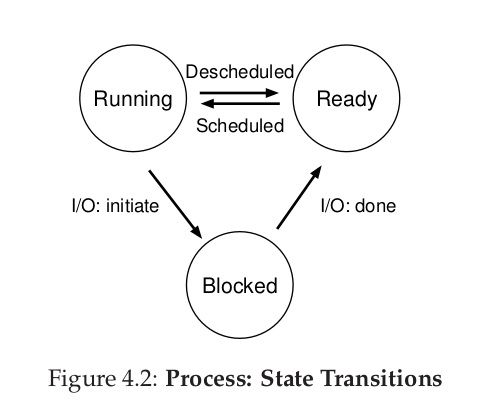

# Operating Systems

An operating system (OS) is system software that manages computer hardware, software resources, and provides common services for computer programs.
An OS is a body of software that is responsible for making it easy to run programs (even allowing you to seemingly run many at the same time), allowing
programs to share memory, enabling programs to interact with devices, and other fun stuff like that. The OS is in charge of making sure the system
operates correctly and efficiently in an easy-to-use manner.

Operating Systems can be divided in three logical topics in order to be studied:

1. **Virtualization**
2. **Concurrency**
3. **Persistence**

According to [2], the operating system is considered the parts of the system responsible for basic use and administration.
This includes the kernel and device drivers, boot loader, command shell or other user interface, and basic file and system
utilities. It is the stuff you need - not a web browser or music players.

On protected memory systems, the kernel has special "privilages" compared to user applications. This includes a protected
memory space and full access to the hardware, called "kernel space". User applications execute in "user-space". Applications
running in user-space communicate with the kernel via system calls.


When an application executes a system call, we say that the kernel is executing on behalf of the application. Furthermore,
the application is said to be executing a system call in kernel-space, and the kernel is running in process context.


## Virtualization

Virtualization of the CPU and memory. Turning a single CPU (or small set of them) into a seemingly infinite number of
CPUs and thus allowing many programs to seemingly run at once is what we call **virtualizing the CPU**.

```
"Let us take the most basic of resources, the CPU. Assume there is one physical CPU in a system (though now there are 
often two or four or more). What virtualization does is take that single CPU and make it look like many virtual CPUs to
the applications running on the system. Thus, while each applications thinks it has its own CPU to use, there is really
only one. And thus the OS has created a beautiful illusion: it has virtualized the CPU" [OSTEP]
```

**Process**

One of the most fundamental abstractions that the OS provides to users: the process. The definition of a process, informally,
is quite simple: it is a running program. The program itself is a lifeless thing: it just sits there on the disk, a bunch of
instructions (and maybe some static data), waiting to spring into action. It is the operating system that takes these bytes and
gets them running, transforming the program into something useful.

Each process accesses its own private **virtual address space** or address space for short, which the OS somehow maps onto the
physical memory of the machine. That's why two running programs may be using the "same" address, e.g., 0x20000, but they're
completely different spaces in the actual physical memory.


## Concurrency

Concurrency - be able to run multiple applications at the "same" time


## Persistance

Persistence via devices and file systems. 


## Advanced Topics

- Networking
- Graphics
- Security


## Frequently asked questions:

- **Operating System**

Resource manager. Software that is responsible for making it easy to run programs
(allowing to run many at the same time), allowing programs to share memory, enabling
programs to interact with devices, and others. The operating system (OS) is in charge
of making sure the system operates correctly and efficiently in an easy-to-use manner.

- **Policy vs Mechanism**

Policies are ways to choose which activities to perform.

Mechanisms are the implementations that enforce policies, and often depend to some
extent on the hardware on which the operating system runs.

Example: A process may be granted resources using the first come, first serve policy.
This policy may be implemented using a queue of requests as a mechanism.

- **Kernel**

The kernel is the core component of an operating system that has complete control
over every resource of a system. It is the portion of the operating system code that
is always resident in memory and facilitates interactions between hardware and 
software components.

Typical components of a kernel are:

    - Interrupt handlers to service interrupt requests
    - A scheduler to share processor time among multiple processes
    - A memory management system to manage process adress spaces
    - System services such as networking and interprocess communication

- **Process and Threads**

A process is a program (object code) in the midst of execution and all data and resources
related to the program running. In other words, a process is the living result of running
program code. Processes provide two virtualizations: a virtualized processor and
virtualized memory.

Process include a set of resources such as open files and pending signals, internal kernel
data, processor state, a memory address with one or more memory mappings, one or more
threads of execution, and a data section containing global variables.

Threads (of execution) are the objects of activity within the process. Each thread
includes a unique program counter, process stack, and a set of processor registers.

- **States of a Process**

    - Running - a process is running (executing instructions) on a processor.
    - Ready - a process is ready to run but for some reason the OS has chosen not to run
    it at this given moment.
    - Blocked - a process has performed some kind of operation that makes it not ready to
    run until some other event takes place.



- **Context Switch**

In short: a switch from one program to another is a context switch.

The OS tracks certain information about each of the processes, such as memory related
info (start of process memory, size, bottom of kernel stack), process ID, process state,
etc. One important component of this information is the register context, which is a
data structure that stores information about the contents of the registers about a
certain process. The register context will hold, for a stopped process, the contents of
its register state. When a process is stopped, its register state will be saved to this
memory location; by restoring these registers the OS can resume running the process.

Context switch is a mechanism where the register context of a certain (stopped) process
is placed back into the actual physical registers of the processor so the OS can resume
running the process.


- **Scheduling**

CPU Scheduling is a process of determining which process will own CPU for execution while another process is on hold. The process scheduling is the activity of the process
manager that handles the context switch between a running process from the CPU and the
selection of another (ready) process to be run on the basis of particular policies [3].

Scheduling allows for a system to be multiprogram ("multitask"), i.e., giving the
illusion to the user that more than one program is running at the same time at a certain
CPU.

Categories of scheduling:

    * Preemptive: the scheduler can interrupt the running process at any time, schedule
    schedule something else and resume the original process later. The OS allocates the
    resources to a process for a fixed amount of time.

    * Non-preemptive: the resources can't be taken from a process until the process
    completes execution.

Scheduling algorithms:

    * FIFO (First-In First-Out) or (FCFS - First Come First Serve)
    * Shortest-Job-First (SFJ)
    * Shortest Remaining Time
    * Priority
    * Round Robin
    * Multilevel Queue Scheduling


The kernel schedules individual threads, not processes.

preemptive, non-preemptive, round robin, O(1), fair O(log n), FCFS

The kernel stores the list of processes in a circular doubly linked list called the task list

have a look at process descriptros - struct task_struct

Process (task) vs Threads - Linux Love p. 24 51/468
 
 
- **Synchronization Mechanisms** 

TODO: Mutex/spinlock/semaphore

To provide synchronization, the kernel can disable interrupts.

- **Memory Management**

TODO: virtual memory/paging/translation/segmentation and thrashing

Slab allocation
Slab allocation is a memory management mechanism intended for the efficient memory allocation of objects. In comparison with earlier mechanisms, it reduces fragmentation caused by allocations and deallocations.

- **Multicore: fundamentals of concurrency constructs**

- **Concurrency Issues**

TODO: race conditions, deadlock and livelock and how to avoid them

- **Producer and Consumer Problem**


- **Caching**

TODO: cache coherency/cache line


- **Memory mapped IO/ IO Mapped IO**

Scheduling IO

- **IPC - Inter Process Communications**


- **Interrupts** 

When hardware wants to communicate with the system, it issues an interrupt that literrally interrupts
the processor, which in turn interrupts the kernel. A number identifies interrupts and the kernel uses this number
to execute a specific interrupt handler to process and respond to the interrupt.

In many OSs (including Linux), the interrupts don't run in process context. They run in an special interrupt context,
that is not associated with any process.

### Resources

[1] [OSTEP](https://pages.cs.wisc.edu/~remzi/OSTEP/)

[2] Linux Kernel Development (3rd Edition), Roberto Love

[3] [Tutorials Point](https://www.tutorialspoint.com/operating_system/os_process_scheduling.htm)
