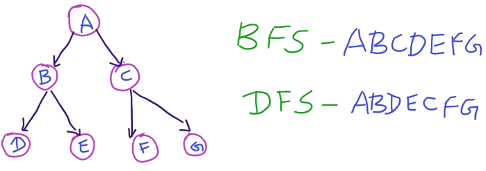

# Depth-First Search (DFS)

## **1. Overview**

**Depth-First Search (DFS)** is a tree and graph traversal algorithm. DFS visit all the nodes in a tree or a graph.

A DFS follows one tree branch down as many levels as possible until the target node is found or the end is reached.

When the search can't go down any further, it is continued at the the nearest ancestor with unexplored children.



In DFS, we start at the root (or another arbitrarily selected node) and explore each branch completely before moving on to the next branch. That is, we go deep first (hence the name depth-first search) before we go wide.

---

## **2. Key Concepts**

* DFS usually uses recursion.

* In DFS, you need a stack. Usually, DFS uses the recursive stack to avoid creating a new data structure.

---

## **3. Applications**

* **Pathfinding in Games:** DFS is often used in video games for pathfinding and exploring game maps.
* **Web Crawling:** search engines use DFS to traverse web pages. When indexing the web, crawlers explore links on a page in depth before backtracking to explore other links, effectively building a comprehensive map of the internet.
* **Puzzle Solving:** DFS is used in solving puzzles like mazes or Sudoku.

---

## **4. Implementation**

In DFS, we visit a node a and then iterate through each of a's neighbours. When visiting a node b that is a neighbour of a, we visit all of b's neighbours before going on to a's other neighbours. That is exhaustively searches b's branch before any of its other neighbours.

The pseudocode below implements DFS:

```c++
void dfs(Node root)
{
    if (root == nullptr) return;
    print(root);
    root.visited = true;

    for_each (Node n in root.adjacent) {
        if (n.visited == false) {
            dfs(n);
        }
    }
}
```

Note that pre-order and other forms of tree traversal are a form of DFS. The key difference is that when implementing this algorithm for a graph, we must check if the node has been visited. If we don't, we risk getting stuck in an infinite loop.

---
