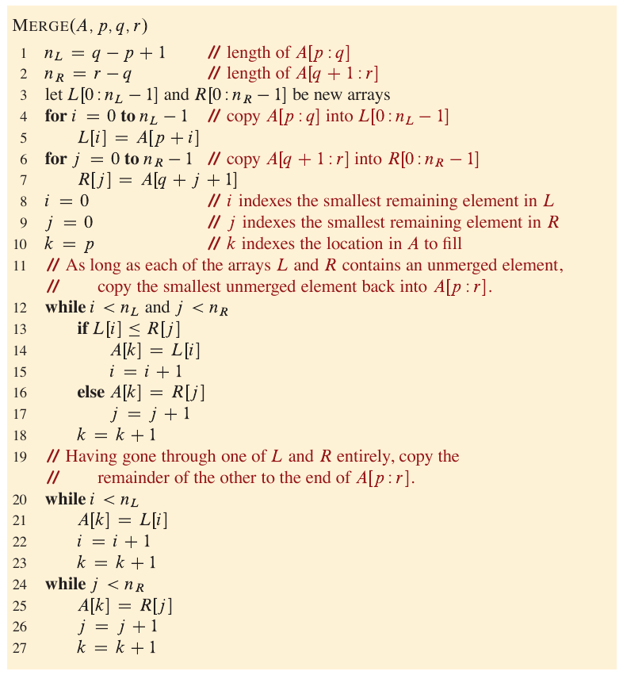

# Merge Sort

Time complexity: O(n log(n))

Merge sort can be highly useful in situations where quicksort is impractical.

The **merge sort** algorithm closely follows the divide-and-conquer method. In each step, it sorts a subarray A[p:r], starting with the entire array A[1:n] (1-index array) and recursing down to smaller and smaller subarrays. Here is how merge sort operates:

* **Divide** the subarray A[p:r] to be sorted into two adjacent subarrays, each of half the size. To do so, compute the midpoint q of A[p:r] (taking the average of p and r), and divide A[p:r] into subarrays A[p:q] and A[q+1:r].

* **Conquer** by sorting each of the two subarrays A[p:q] and A[q+1:r] recursively using merge sort.

* **Combine** by merging the two sorted subarrays A[p:q] and A[q+1:r] back into A[p:r], producing the sorted answer.

The recursion reaches the base case when the subarray A[p:r] to be sorted has just one element when p equals r (an array comprising just a single element is always sorted).

The key operation of the merge sort algorithm occurs in the "combine" step, which merges two adjacent, sorted subarrays. The merge operation is performed by the auxiliary procedure `merge(A, p, q, r)` where A is an array and p, q, and r are indices into the array such that p <= q < r. The procedure assumes that the adjacent subarrays A[p:q] and A[q+1:r] were already recursively sorted. It **merges** the two sorted subarrays to form a single sorted subarray that replaces the current subarray A[p:r].



Merging takes O(n) time.

---

## **4. Implementation**

Merge sort pseudocode:

```
Merge-Sort(A, p, r):
    if p >= r               // zero or one element?
        return
    q = (p+r) / 2           // midpoint of A[p:r]
    Merge-Sort(A, p, q)     // recursively sort A[p:q]
    Merge-Sort(A, q+1,r)    // recurisvely sort A[q+1:r]
    // Merge A[p:q] and A[q+1:r] into A[p:r]
    Merge(A,p,q,r)
```

---
