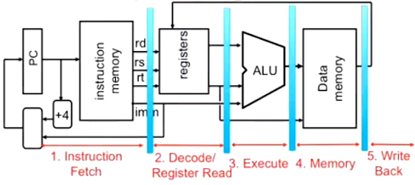

# Computer Architecture

Simplified version of instruction execution on a computer:

1. Processor fetches instruction from memory
2. Processor executes the instruction
3. Goto 1

In reality, it is more complex because of:

* Pipelining
* VLIW
* Superscalar architectures (PowerPC 970)

From an embedded software engineer perspective, it's important to understand how processors execute instructions in order to understand the timing of the code we write and to ensure that our system will meet its timing requirements, this way, we can understand what are the influences that different instructions can have on the execution time of a function.

## Von Neumman vs Harvard

The Von Neumman architecture has a shared data and program memory.

The Harvard architecture has a separate data and program memory. With Harvard architecture, you can fetch the instruction and data associated with it in parallel. This is useful for streaming applications where you need to read data from a sensor, and fetch the instruction to process that data.

A disadvantage of the Harvard architecture is the memory fragmentation caused by not being able to store data in the instruction memory, or instructions on the data memory.

## Central Processing Unit (CPU)

## Memory

The processor fetches the instruction from memory.

## Processor Registers

Program status register: negative bit, zero bit, carry bit, overflow bit.

## Program Counter (PC)

The program counter (PC) holds the addres of the intruction to be fetched next. The PC increments to the next instruction or it will jump to a a branch in case of a jump instruction.

## Complex Instruction Set Computers (CISC)

* x86

## Reduced Instruction Set Computers (RISC)

* ARM
* RISC-V

## Pipelining

Sequential execution of instructions is inefficient. Pipelines break instructions into pieces and overlap stages. Processor pipelines improve performance.

**Pipeline registers.**

You need **registers between stages** to hold information produced in the previous cycles.

## Pipeline Hazards

What problems can occur with pipelines? not every instruction might take exactly one instruction on the execution stage. 

Jumps also cause problems becuase you might have fetched and decoded other two instructions.

A **data stall** occurs when an instruction is delayed because it depends on the result of an earlier instruction that has not yet finished.

A **control stall** is a delay in the instruction pipeline that occurs when a control hazard prevents the next instruction from executing on time. Control hazards happen when a decision needs to be made about a conditional branch before the condition or target can be calculated.

## Very Long Instruction Word (VLIW)

## Superscalar Processor

## Program Status Register

## Big Endian vs Little Endian

Most architectures nowadays use little-endian except for AVR, which uses big-endian.

One advantage of little-endian is that small 8-bit processors can start processing data as soon as you load the first byte.
