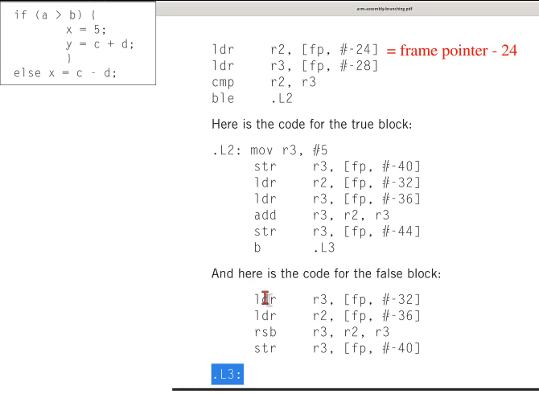

# ARM

ARM (Advanced RISC Machines) is a family of RISC instruction set architectures (ISAs) for computer processors.

ARM assembly branching example:

## ARM Versions

**ARMv7**

ARMv7 is von Neumman architecture.

ARMv7 has three stages: fetch, decode, and execute.

**ARMv8**

[ARMv8](https://mariokartwii.com/armv8).

Raspberry Pi 4.

**ARMv9**

ARMv9 uses Harvard architecture.

## ARM Cortex-A

Application processor cores for a performance-intensive systems.

* iMX.8 - Cortex-A (mainly) for automotive applications
* BCM2711 - Broadcom chip used in Raspberry Pi 4 model B. Quad-core Cortex-A72 (ARM v8) 64-bit SoC @ 1.5 GHz.

## ARM Cortex-M

Microcontroller cores for a wide range of embedded applications. Usually, they don't have MMU (memory management unit).

## ARM Cortex-R

High-performance cores for real-time applications.

## ARM Execution Levels

The processor can be executing in different modes of operation, therefore different registers are available.

ARM Execution Levels:

* EL0 - User applications
* EL1 - OS kernel (supervisor)
* EL2 - Hypervisor
* EL3 - Secure monitor

## ARM Exceptions

Four types of exceptions:

* Software
* Hardware
* Fast
* Exceptions
