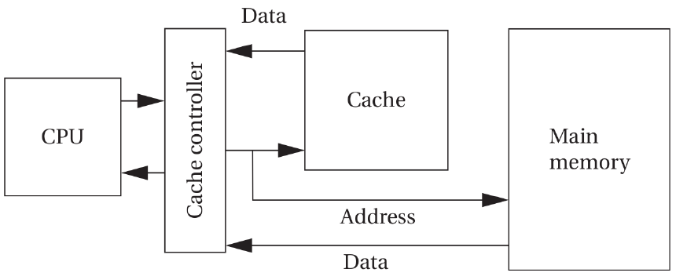
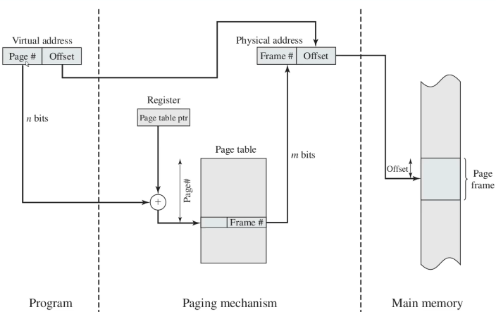
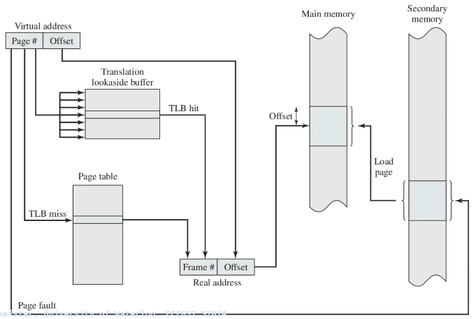
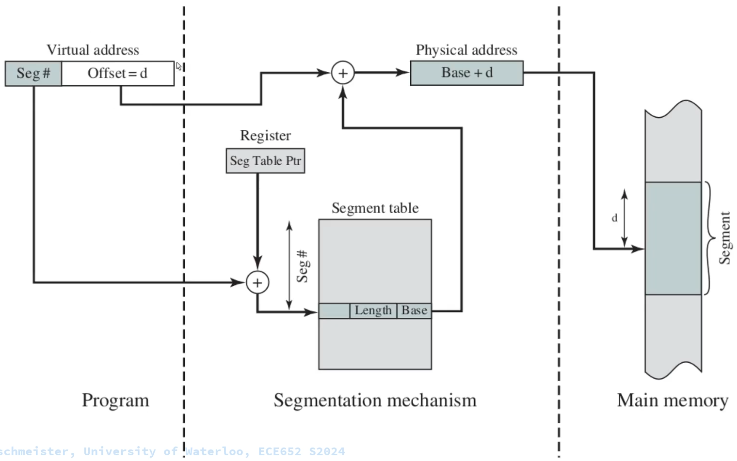
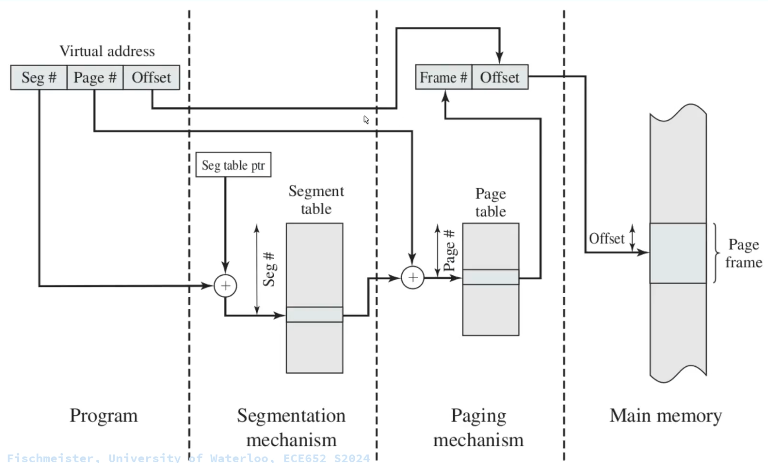

# Memory

This page discusses memory, memory hierarchy, caching, and virtual memory in modern embedded systems.

## Cache

The cache is the fastest and most expensive memory that you can have in your computer system. The cache memory is inside the processor.

The cache is a very limited amount of memory in your system. Hence, you need to have a main memory.

The cache is a small and fast memory that keeps the working set of a program close to the computation.

Processors might have multiple levels of caches before you need to go find your data at main memory.

### Cache Concepts

* **Cache Hit**

* **Cache Miss**

* **Cold Miss**

* **Capacity Miss**

* **Conflict Miss**

A conflict miss occurs when you try to load two consecutive memory areas into the same cache line.

* **Hit Rate**

* **Miss Rate**

* **Write Through**

* **Write Back**

## Memory Hierarchy

The memory hierarchy says that the faster the memory is, the lower its capacity and the more expensive it is. The cheaper memory is thus slower, and we can get a bigger capacity.

Accessing memory in the main memory is slower than accessing data in the cache.

## Virtual Memory and Memory Address Translation

Virtual memory is enabled by memory address translation.

Memory address translation provides a layer of indirection to enable additional functionality where the address a program tries to access is not the same as the physical address in memory where this data is located.

When a program tries to access an address a particular address, that doesn't mean that it will find it at that specific address; instead, thanks to virtual memory, there's a layer of indirection between these two addresses.

Uses of virtual memory:

* Multitasking
* Memory protection
* Data security
* Larger address space

Microcontrollers used in embedded systems usually don't include an MMU. Thus, virtual memory is not immediately accessible to embedded systems programmers. In ARM microcontrollers, you can use the MPU to mark memory regions as code or data to add an extra layer of memory protection.

Virtual memory concepts:

* **Paging**

In a system that uses memory paging, the process sees a virtual address.

In computer operating systems, memory paging (or **swapping** on some Unix-like systems) is a memory management scheme by which a computer stores and retrieves data from secondary storage for use in main memory.

In paging, the operating system retrieves data from secondary storage in same-size blocks called **pages**.

Paging is an important part of virtual memory implementations in modern operating systems, using secondary storage to let programs exceed the size of available physical memory.

Since access to the page table takes time, operating systems offer a Translation Lookaside Buffer (TLB). The TLB is a cache for table lookups.

Paging has the disadvantage that if you want to group multiple pages and assign them specific meaning, e.g., the program memory, you would have to do so for each page.

All pages have the same size.

* **Segmentation**

Segmentation provides an alternative method for paging.

Memory segmentation is an operating system memory management technique of dividing a computer's primary memory into segments or sections. In a computer system using segmentation, a reference to a memory location includes a value that identifies a segment and an offset (memory location) within that segment.

Segments or sections are also used in object files of compiled programs when they are linked together into a program image and when the image is loaded into memory.

Segments can have a dynamic length.

A problem when using segmentation is memory fragmentation. The solution is to use **segmentation** and **paging** together.

Everything in one picture:

* **Relocation**

* **Swapping**

* **Authorization**
