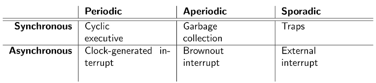

# Real-Time Systems

Is real-time = speed? No. Real-time systems are about to meeting deadlines, not about speed of processing. As long as you meet the deadline, the system can execute as fast as required.

We can categorize computer systems in:

* **Batch**: you don't mind when results arrive. Example: simulation, super-computing.

* **Interactive-online**: want good response time; best effort. Example: GUI, booking systems.

* **Real-time**: need bounded delays; best effort is not good enough. Example: break-by-wire, aircraft control system, car engine management.

Real-time systems need to produce the right value on time.

## Cyber-Physical Systems

Real-world systems require many different expertise: software, hardware, electrical engineering, theory, security, dependability...

... but also other domain-specific engineering disciplines: physics, mechanical engineering, material sciences, civil engineering, chemistry, ...

Cyber physical systems represent the confluence of all these areas into one systems theory.

## Real-Time Scheduling

Systems have periodic, aperiodic, and sporadic tasks.

* Periodic: repeats with respect to a specific time. Example: clock tick.

* Aperiodic: repeats randomly: Example: emergency shutdown.

* Sporadic: repeats with respect to a minimum inter-arrival time. Example: most external interrupts.

Events can be synchronous and asynchronous with respect to the control flow. Synchronous events occur at predictable times; otherwise they are asynchronous.

Don't mix this up with syncrhonous systems!

**Task**

* A larger piece of functionality in your real-time system.
* Simple task vs complex task (depends on external events).

**Job**

* A unit of work that is scheduled.
* A task consists of multiple jobs.
* Often, a task consists of a single job.

Job Characteristics:

* Release time
* Deadline
* At any point, between the release time and the deadline, the job needs to run on the processor.
* The job NOT necessarily starts executing after its release time. There might be another job with a higher priority that will use the processor.
* Maximum response time must be less than relative deadline. If this requirement is not met, catasthropic events can occur.
* Tardiness specifies how long the job is overdue. If a job completes at or before the deadline, the tardiness is zero.

**Preemption**

* Preemption occurs when a task with a higher priority than the current task is released, the processor will interrupt (preempt) the current task, store its state, and run the newly released task.

**Hard Real-Time Systems**

Characteristics:

* Missing a deadline is considered a fatal fault.
* Tardiness must always be zero!

Applications and notes:

* Safety-critical hard real-time systems.
* Often, the number of allowed misses is specified via probabilities (e.g., 10^-7 or 10^-9 per operated hour).
* Burden is on the developer to proof that this is met.

It's hard to develop and proof the correctness of a real-time system.

Elements in the hardware as caches, pipelining, branch prediction and even events in the environment can change the execution time of tasks, thereby demonstrating a tardiness of zero in your system is a really hard problem.

**Soft Real-Time Systems**

Characteristics:

* Missing a deadline is undesirable.
* Computed values are useful after the deadline.

Applications and notes:

* Examples: online transaction systems, games, consumer electronics.
* Class of systems: quality of service applications.
* Used with different terminology outside the real-time community.
