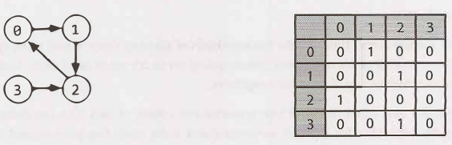
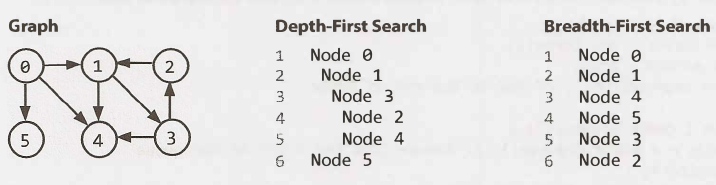

# Graphs

Graphs are important — more than you think. Even if you already think they're important, it's more than you think.

A tree is a connected graph without cycles, i.e., a type of graph, but not all graphs are trees.

You should know the basic graph traversal algorithms: breadth-first search and depth-first search. You should know their computational complexity, their tradeoffs and how to implement them in real code.

If possible, try to study fancier algorithms, such as Dijkstra and A*. They're great for just about anything, from game programming to distributed computing, to you name it. You should know them.

Whenever someone gives you a problem, think of graphs. They are the most fundamental and flexible way of representing any relationship, so it's about a 50-50 shot that any interesting design problem has a graph involved in it. Make sure you can't think of a way to solve it using graphs before moving on to other solution types. This tip is important!


## **1. Overview**

* **Definition:** Graphs are flexible data structures that use nodes and edges to store information. A graph is a collection of nodes with edges between (some of) them.

Graphs can be either directed or undirected. While directed edges are like a one-way street, undirected edges are like a two-way street.

A graph might consist of multiple isolated subgraphs. If there is a path between every pair of vertices, it is called a "connected graph".

A graph can also have cycles (or not). An **acyclic graph** is one without cycles.

* **Use Cases:** 
  * Example: Efficient searching and sorting (e.g., database indexing).
  * Example: Suitable for priority-based tasks (e.g., heaps for priority queues).

---

## Representing a Graph

There are three basic ways to represent a graph in memory (objects and pointers, adjacency matrix, and adjacency list), and you should familiarize yourself with each representation and its pros and cons.

### Adjacency List

This is the most common way to represent a graph. Every vertex (node) stores a list of adjacent vertices. In an undirected graph, an edge like (a, b) would be stored twice: once in a's adjacent vertices and once in b's adjacent vertices.

A simple class definition for a graph node could look essentially the same as a tree node.

```java
class Graph {
    public Node[] nodes;
}

class Node {
    public String name;
    public Node[] children;
}
```

The `Graph` class is used because, unlike in a tree, you can't necessarily reach all the nodes from a single node.

### Adjacency Matrix

An adjacency matrix is an NxN boolean matrix (where N is the number of nodes), where a true value at matrix[i][j] indicates an edge from node i to node j. You can also use an integer matrix with 0s and 1s.

In an nudirected graph, an adjacency matrix will be symmetric. In a directed graph, it will not (necessarily) be symmetric.



## Graph Search

If the graph's structure offers no navigation help, you must visit every node until you find the one you want. The two most common ways to search a graph are depth-first search and breadth-first search.

* **Depth First Search (DFS):** searching a graph via DFS, we keep following edges going deeper and deeper into the graph. When you reach a node with no edges to any new nodes, you return to the previous node and continue the process.

More information [here](https://roemvaar.github.io/computer_science_notes/docs/algorithms/dfs.html).

* **Breadth First Search (BFS):** starts at the tree root and explores all nodes at the present depth prior to moving on to the nodes at the next depth level. Extra memory, usually a queue, is needed to keep track of the child nodes that were encountered but not yet explored.

More information [here](https://roemvaar.github.io/computer_science_notes/docs/algorithms/bfs.html).

See the below depiction of a graph and its depth-first and breadth-first search (assuming neighbors are iterated in numerical order).



## DFS vs BFS

Breadth-first search and depth-first search tend to be used in different scenarios. DFS is often preferred if we want to visit every node in the graph.

If we want to find the **shortest path** (or just any path) between two nodes, BFS is generally better.

## Shortest-Path

* Bidirectional Search
* Dijkstra
