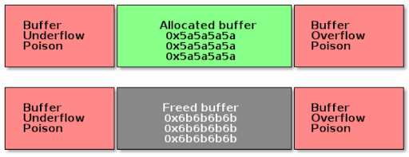

# Debugging

The Linux kernel provides a set of tools and debug options useful for investigating abnormal behavior.

## Decoding an oops / panic

An **oops** is the usual way a kernel communicates to the user that something bad happened, i.e., an inconsistent state that the kernel detects inside itself. Because the kernel is the supervisor of the entire system, it cannot fix itself or kill itself as it can when user-space goes awry. Instead, the kernel issues an oops.

## How would you debug a Linux kernel module or a driver?

## crash, drgn, kgdb

One essential part of Linux kernel development is debugging. In user space we have the support of the kernel, i.e., we can halt processes and use gdb to inspect the program’s state and behavior. In kernel space, in order to use gdb we need to use a hypervisor like QEMU or JTAG based hardware interface which are not always available.

## List debugging
## Memory debugging

Memory bugs:

* Use before initialize bug
* Use after free bug
* Buffer overflow bug

There are several tools for memory debugging:

* SLAB/SLUB debugging

Slab debugging uses a memory poison technique to detect several types of memory bugs in the SLAB/SUB allocators. The allocated buffers are guarded with memory that has been filled in with special markers.

* KASAN
* kmemcheck
* DEBUG_PAGEALLOC

## Locking debugging

## Profiling
