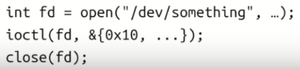

# Fuzzing the Linux Kernel

* How do we generate inputs?
	* (Dumb) generate random blobs
	* (Smart) structured blobs

	* Internal - Kernel only accepts single syscalls, and not blobs as inputs
		* Simple syscalls: When you fuzz the kernel, a "single" input generated by the fuzzer can mean multiple syscalls, i.e., call API and then follow through. Example in Figure 1.

		* Other syscalls: not all syscalls accept simple structures as arguments

	* External
		* Network: seem like blobs, more like API due to protocol syntax (e.g., TCP SYN/ACK numbers)
		* USB: host driven communication, the fuzzer is responding to API calls

Figure 1. Simple Syscalls

* How do we detect crashes (or other kind of bugs)?
	* Detecting bugs
		* Use dynamic bug detectors: KASAN, KMSAN, and KCSAN.
		* Write your own detectors: checks for logical bugs and asserts.

* How do we automate the process?
	* Be able to leave the fuzzer running for the night
	* Automation:
		* Monitoring kernel log for crashes, restarting crashed VMs, deduplicating crashes, generating reproducers, reporting bugs / tracking fixes
			* Basically all the fun stuff that syszkaller/syzbot do

## Linux Kernel Fuzzers

* Trinity: find less bugs, easier to deploy, simpler fuzzer
* Syzkaller: goes deeper, find more bugs, easier to extend

### Syzkaller

* test cases (including isolation)
* coverage-guidance (using KCOV)
* language to describe API/structures (syzlang)
* automation (scalability, reproducers, dashboards, syzbot)

### Fuzzing Approaches - pragmatic:

* Building code as userspace app and fuzzing that
* Reusing a userspace fuzzer (AFL, libFuzzer, ...)
* Using syzkaller
* Writing a fuzzer from scratch

### Using syzkaller:

* See syzkaller talks for usage
* Good at fuzzing API-based interfaces out-of-the-box
* syzkaller is extensible

* Tip #1: Don't just fuzz mainline with the default config
	* This is already done by syzbot
	* Add new descriptions
	* Tighten attack surface: fuzz a small number of related syscalls
	* Fuzz distro kernels

* Tip #2: Build your fuzzer on top of syzkaller
	* Specific fuzzer for USB and KVM build on top syzkaller

* Tip #3: Use syzkaller as a framework
	* Only use crash parsing code
	* Only use VM management code

### Fuzzing Tips

* Read the code 
	* Understand the code you're fuzzing 
		* What kind of inputs it expects 
		* Which part you are trying to target 
	* Write a fuzzer based on that 
		* Writing fuzzer based on specs/docs does not work well, you need to understand the code that you're targeting

* Is my fuzzer good? 
	* Check code coverage, make sure you cover the targeted layer
	* Inject bugs (WARN_ON()/BUG_ON()) and check that the fuzzer finds them
	* Revert fixes for bugs/CVEs and check that fuzzer finds them

* Fast vs Smart
	* Fast fuzzer: more execs/sec 
	* Smart fuzzer: better input generation, relevant guidance signal 
	* Focus smart in the first place 
