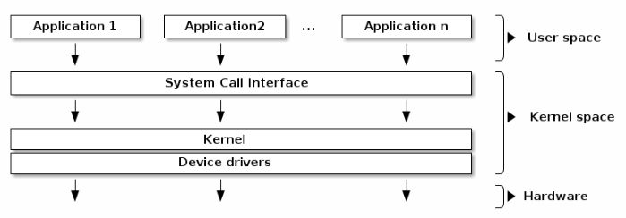

# Linux Kernel

## What is the Linux kernel, and what is its purpose?

In typical OS architecture, the kernel is responsible for accessing and sharing the hardware securely and fairly with multiple applications.

In practice, the operating system's role is to provide programs with a consistent view of the computer's hardware. In addition, the operating system must account for the independent operation of programs and protection against unauthorized access to resources. This nontrivial task is possible only if the CPU enforces protection of the system software from the applications.

The kernel is a large, standalone program with detailed and explicit requirements on how its pieces are put together.

Every software package used in a Linux system has its release number, and there are often interdependencies across them.

## Main components of the Linux kernel?

The core kernel is divided into multiple logic subsystems:

* File access
* Networking
* Process management
* Scheduling
