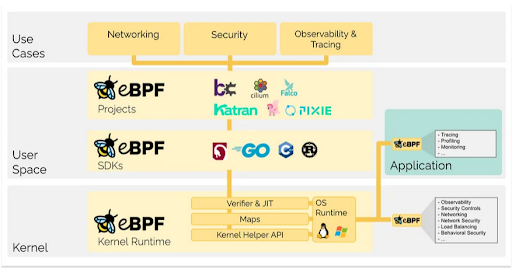
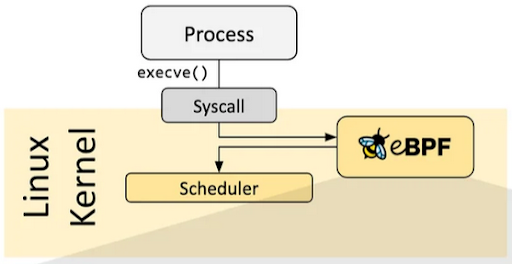

# Tracing

The term tracing refers to performance analysis and observability tools that can produce per-event info. `tcpdump` and `strace` are specialized tracers.

## Tracing tools based on eBPF

## What is eBPF?

eBPF is a technology that can run sandboxed programs in a privileged context such as the Linux kernel. eBPF is used to safely and efficiently extend the capabilities of the kernel at runtime without requiring to change kernel source code or load kernel modules. Use cases: next-generation networking, observability, and security functionality.

eBPF is part of the Linux kernel. People use eBPF and code in it via frameworks. For tracing, the main ones are **bcc** and **bpftrace**. 

eBPF programs are event-driven and are run when the kernel or an application passes a certain hook point. Pre-defined hooks include system calls, function entry/exit, kernel tracepoints, network events, and several others.

